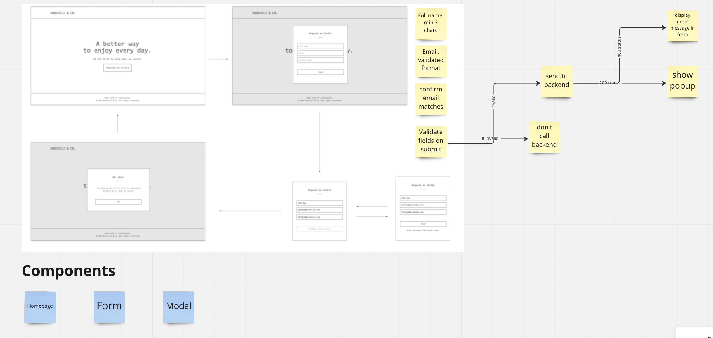
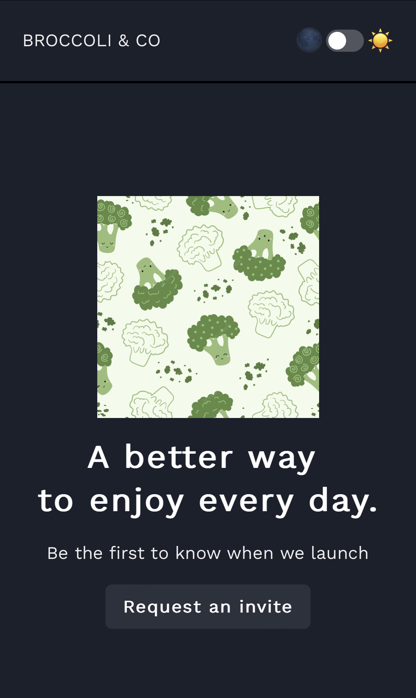
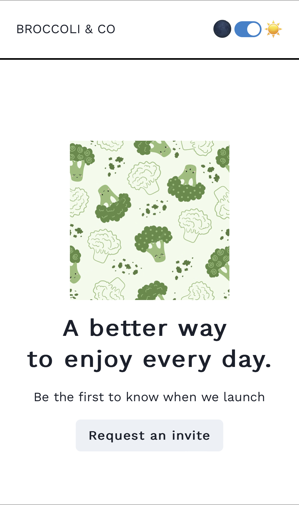

# Blinq Code Challenge

Check out the site here!
https://suzy-blinq.netlify.app/

## Tech used:

- React
- Javascript

Third-Party library components, including:

- Chakra-ui
- React testing library

## Approach

### 1. Planning

- Added requirements to a visual board (Miro)
- Map out a high level approach to solution and components
  

### 2. Basic structure

- Set up the new React app
- Installed Chakra ui library
- Added skeleton components

### 3. Modals

- Created FormModal (intentionally did not use a library like Formik for forms)
- Used the native HTML validation for name and email fields
- Created custom validation for checking same email

### 4. API Connection

- Updated FormModal to respond to server errors
- Added SuccessModal to render after successful submission

### 5. Styling

- Apply additional styling for the app
- Added light and dark mode

### 6. Testing

- Added basic tests for rendering components and checking a function (this is my first adventure into testing so they are light 🙂 - it was fun!)

### 7. Future considerations

- Add more unit and integration tests
- Switch to a form library (React forms are tricky!)
- Add inline validation for form fields by using a custom validation approach

## Mobile App - Dark and Light Mode

P.S find the 🐰🪺
